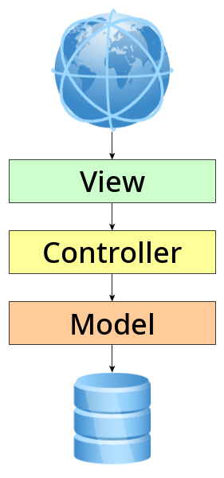
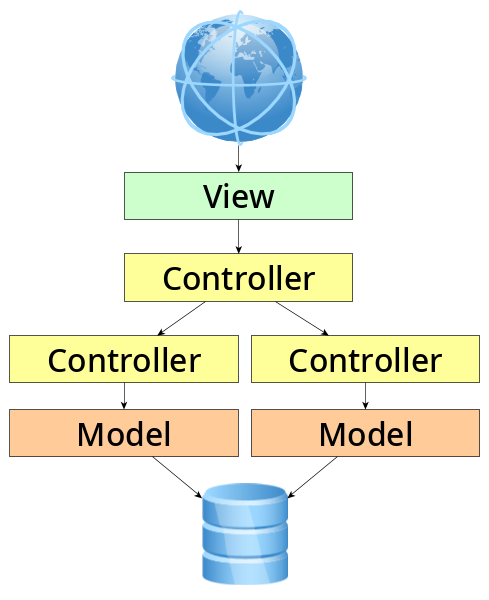
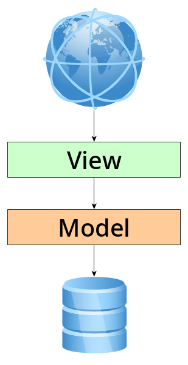
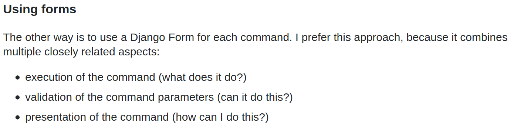
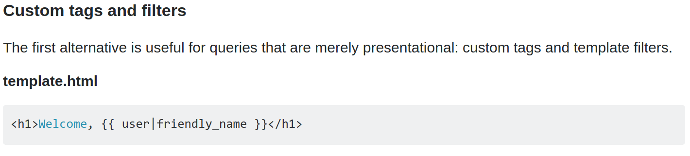
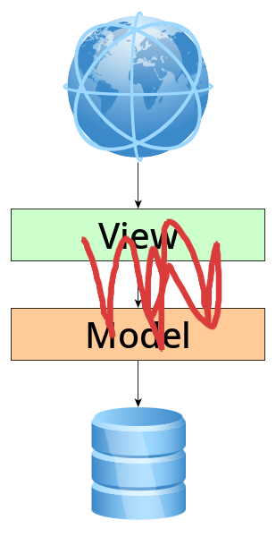

<!--
_backgroundImage: "linear-gradient(to bottom, #000 0%, #1a2028 50%, #293845 100%)"
_class: lead
_color: white
_paginate: false
_footer: ""
-->

<style>
footer {
    display: table
}
.hljs-variable { color: lightblue }
.hljs-string { color: lightgreen }
.hljs-params { color: lightpink }
</style>

# Как Java-роботы видят Python

Паша Финкельштейн, JetBrains
Барух Садогурский, JFrog


---
<!--
_backgroundImage: "linear-gradient(to bottom, #000 0%, #1a2028 50%, #293845 100%)"
_class: lead invert
_color: white
-->


# Тот самый дядюшка Барух

### Приходите, детишки, ко мне в твиттер @jbaruch

---
<!-- _color_: white
_class: lead invert
 -->


# @asm0di0 at Twitter
# @asm0dey evrwr

---


---
<!--
_backgroundImage: "linear-gradient(to bottom, #000 0%, #1a2028 50%, #293845 100%)"
_class: lead invert
_color: white
-->

# Я :heart: Python

---
<!--
_backgroundImage: "linear-gradient(to bottom, #000 0%, #1a2028 50%, #293845 100%)"
_class: lead invert
_color: white
-->


# <!-- fit --> Python :snake::heartpulse: меня

---



# <!-- fit --> Как всё устроено в Java

- Скучно
- Все всё понимают

---



# Сложная логика?

- Всё ещё скучно
- Слишком просто

---
<!-- _class: lead -->


# Фичефлаги?

* Ну вы поняли

---

<style scoped>
section img{
    position: absolute;
    height: 80%;
    right: 15px;
    bottom: 0;
}
</style>



# Django

- А где логика?


---
<!-- _class: lead -->


---
<!-- _class: lead -->





---


# Звонок другу!

https://phalt.github.io/django-api-domains/

```python
def get_book(*, id: uuid.UUID) -> Book:
    book = Book.objects.get(id=id)
    author = AuthorInterface.get_author(id=book.author_id)
    return {
        'name': book.name,
        'author_name': author.name,
    }
```

[django-best-practices/Make'em Fat](https://django-best-practices.readthedocs.io/en/latest/applications.html#make-em-fat)

---


---
<!-- _class: lead -->



# Где логика, Джанго?


---

# <!-- fit --> Серьёзные ребята знают, как делать правильно!

[github.com/mdn/kuma/blob/master/kuma/authkeys/models.py](https://github.com/mdn/kuma/blob/master/kuma/authkeys/models.py)

```python
from django.utils.translation import ugettext_lazy as _

def generate_key():
    """Generate a random API key."""
    ...
```

---

## Продолжаем разбирать

```python
class Key(models.Model):
    """Authentication key"""
    ...

    
    def generate_secret(self):
        self.key = generate_key()
        secret = generate_key()
        self.hashed_secret = hash_secret(secret)
        return secret
```

---

# А что не так-то?

* А что, если нам понадобится поменять алгоритм шифрования?
* Сложную логику создать невозможно
* Транзакциями управлять тоже невозможно
* Логирование прямо в модели?
---


---

# В Spring

```java
// View
@Controller class MyController {
    @Inject MyService service;
    @GetRequest("/deal") UUID deal(@Valid Deal deal){
        service.saveDeal(deal);
```


---

# В Spring

```java
// Controller
@Transactional
@Service class MyService {
    @Inject Repo1 repo1; @Inject Repo2 repo2;
    @Inject Repo3 repo3; @Inject Repo4 repo4;
    Result<UUID> deal(Deal deal){
        if(/* check */) {}
        else if(/* check */) {
            repo1.save(/* */);
            repo2.save(/* */);
        }
        return /**/;
```
---

# В Spring

```java
// Model
@Repository class MyService {
    @Inject Datasource ds;
    UUID save(Deal deal){
        try(var con = ds.getConnection()){
            var stmt = con.createStatement("INSERT INTO … RETURNING");
            stmt.fetchResult();
            return /* */;
```

---

# На что обратить внимание

- DI
- Разделение ответственности
- `Result<UUID>`

---

# Если вы уже :heart_eyes: DI

[dry-python/dependencies](https://github.com/dry-python/dependencies)

```python
class MyController(Injector):
    my_service = MyService

class MyService(Injector):
    repo1 = Repo1
    repo2 = Repo2

class Repo1(Injector):
    data_source = DataSource
```

---
# На слои поделили

Чтобы не сломать, можно использовать [seddonym/import-linter](https://github.com/seddonym/import-linter)

```ini
[importlinter]
root_package = mypackage

[importlinter:contract:1]
name = My three-tier layers contract
type = layers
layers=
    mypackage.endpoint
    mypackage.service
    mypackage.repository
```
---
<!-- _class: lead -->

# Если вы уже :heart_eyes: `Result<UUID>`

[dry-python/returns](https://github.com/dry-python/returns)

---
<!-- _class: lead -->

# <!-- fit --> Сложно управлять транзакциями?


---
<!--_class: lead -->
# Транзакции — это не пара `BEGIN`-`COMMIT`, а бизнес-сущность

---

Есть сторис, который позволяет описать бизнес-путь


```python
class Subscribe:
    @story
    @arguments('category_id', 'profile_id')
    def buy(I):
        I.find_category
        I.find_profile
        I.check_balance
        I.persist_subscription
        I.show_subscription
```

[proofit404/stories](https://proofit404.github.io/stories/)

---

# Django transactions

```python
from django.db import transaction

@transaction.atomic
def viewfunc(request):
    # This code executes inside a transaction.
    do_stuff()
```

Опять на View 🤦🏽‍♂️

[transaction.atomic](https://docs.djangoproject.com/en/3.0/topics/db/transactions/#django.db.transaction.atomic)

---
# В джаве стандартизировано ВСЁ

* Транзакции — JTA
  * JMS — работа с message-брокерами
  * JDBC — работа с БД
* JSP, JSF — стандарты бэкенд-рендеринга страниц
  И это надёжная основа
* CDI — Context and Dependency Injection
* JSR-330 — Dependency Injection
* JSR-303 — Validation

---
# Но не будем о грустном

### Поговорим об исключениях

* Или это тоже грустное?

* В Python все исключения *unchecked*: фиг поймаешь.
* В Java можно поделить
  * Но множество «важных» исключений — *checked*: фиг откажешься ловить

---
И что?

```java
void someFun() {
    try {
        instance.call(payload);
    } catch (IOException e){
        logger.info("Can't write to FS");
    } catch (UnknownUserException e){
        logger.info("Who am I?")
    }
    // etc, etc…
}
```

---
<!-- _class: lead -->


# И только Kotlin :heart:

Всё unchecked, но если **очень надо™** — то есть аннотация `@Throws`

---
<!-- _class: lead invert -->


# <!-- fit --> Экосистема

---
# Я долго ругал Django

Но есть и хорошие части!

* Комьюнити огромно!
* Django ORM тупит? [django-perf-rec](https://pypi.org/project/django-perf-rec/)
    ```python
    def test_home(self):
        with django_perf_rec.record():
            self.client.get('/')
    ```
    записывает все запросы в `.yml` файл
* [django-stubs](https://pypi.org/project/django-stubs/) Добавляет типы в Django! :heart_eyes:


---

# Все понимают, что типы нужны

- `mypy`
- [dry-python/returns](https://github.com/dry-python/returns)
- [wemake-python-styleguide](https://github.com/wemake-services/wemake-python-styleguide)

---
## Что не так с PyPI

* Зависимость добавляется так: 
* А куда она добавится?
* А что подтянется вместе с ней?
* А конфликтует ли она с моими зависимостями?
* Совместима ли она с моей версией Python? Как добавить старую версию?
* Безопасна ли она?

---
# Безопасна?
Если нам повезёт — мы будем устанавливать приложение глобально
Если нам повезёт — в setup.py будет аналог `rm -rf /*`

https://pages.charlesreid1.com/dont-sudo-pip/

А даже если не `sudo` — эта штука может сотворить всё что угодно!

**И от этого не спастись!**

---

# Зло

`setup.py` — чистое зло, которое мы никогда не сможем контролировать, пока оно живо.

Один из путей к убийству `setup.py` — `poetry`.

https://python-poetry.org/

* Unified dependency management
* Unified setup.py **generation**
* TOML вместо кастомного формата

---
# Типы упаковки

* Egg. Умер, был нестандартизирован, но зато сравнительно безопасен
* Wheel. Жив и опасен
Хочется лучшего из обоих миров…

---
# Или выход есть?

`pip install safety` :japanese_ogre::ghost:

Эта штука может проверить уже добавленные библиотеки  :smile:

Но в целом Safety — это линтер. А линтеры — это хорошо.

---
# Какие ещё есть?

* bandit — статический анализ security
* dlint — ещё сколько-то проверок

---
<!--
_backgroundImage: "linear-gradient(to bottom, #000 0%, #1a2028 50%, #293845 100%)"
_color: white
-->
# О чём я говорил

1. Python прекрасен!
2. Экосистема огромна
3. Уже очень много чего есть — надо только уметь искать :)
4. То. чего не хватает — можете добавить вы, комьюнити!
5. Творите добро!

---
<!--
_backgroundImage: "linear-gradient(to bottom, #000 0%, #1a2028 50%, #293845 100%)"
_class: lead
_color: white
_paginate: false
_footer: ""
-->

# Спасибо!

## Вопросы?

@asm0dey @jbaruch
https://newpodcast2.live
